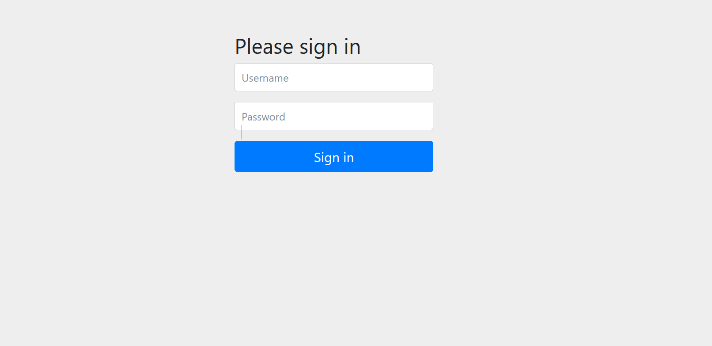
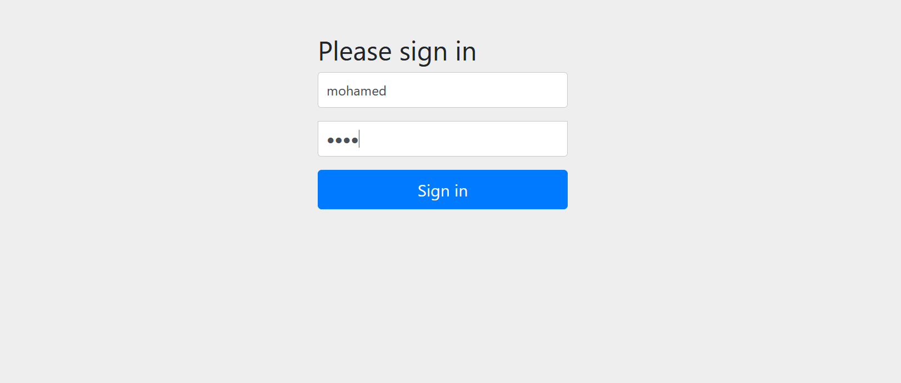
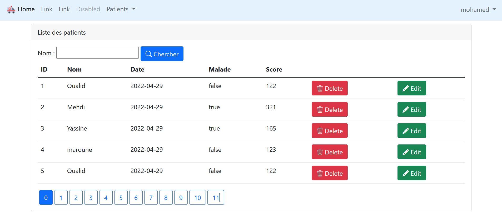
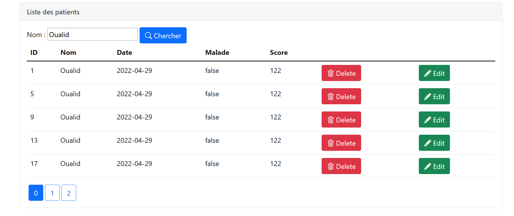
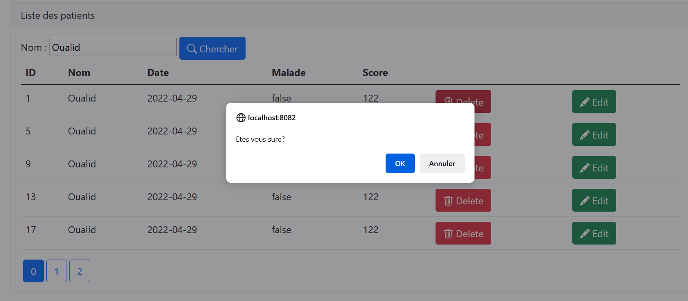
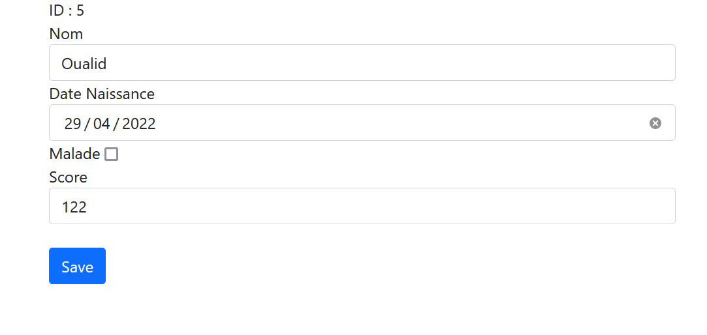
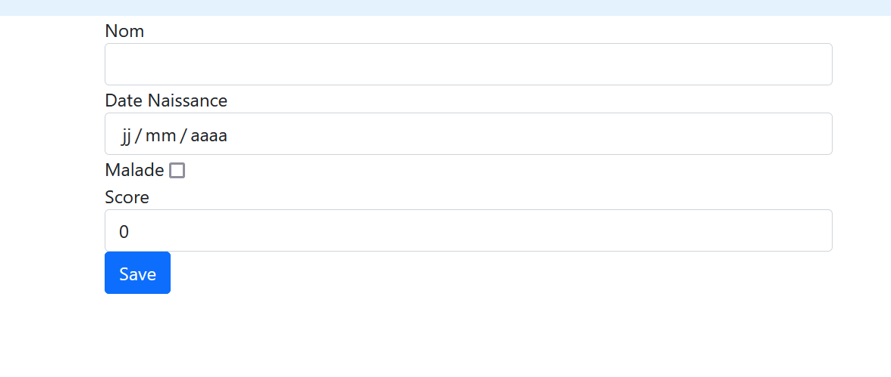
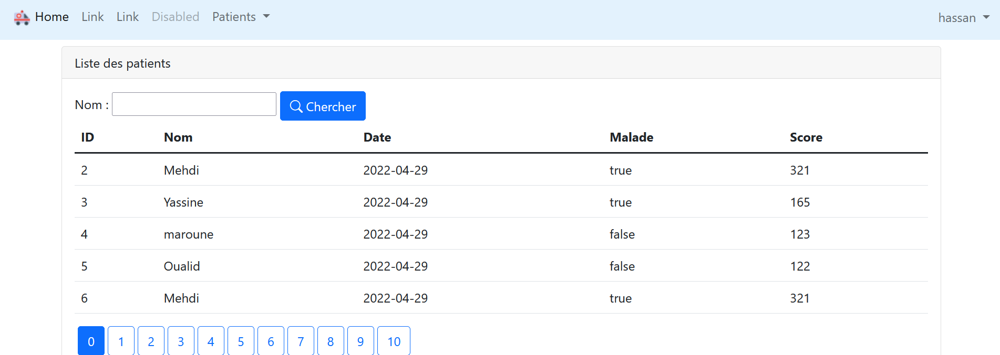

<h2> Compte Rendu</h2>
<h3>Page d'accueil</h3>

<h3>Page de connexion</h3>

<h3>Connexion avec User Mohamed (ADMIN)</h3>

<h3>les fonctionnalités de l'admin</h3>

Il permet d'ajouter, modifier, chercher, supprimer un utilisateur

<h3>Chercher un utilisateur par nom</h3>

<h3>Supprimer un utlisateur avec confirmation</h3>

<h3>Modifier un utilisateur</h3>

<h3>Ajouter un utilisateur</h3>

<h3>Espace des utilisateurs simples</h3>

Après la connexion, l'utilisateur simple il a le droit seulement de faire des recherches 

